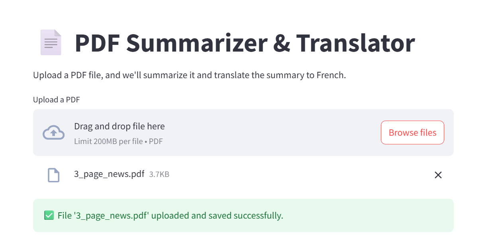
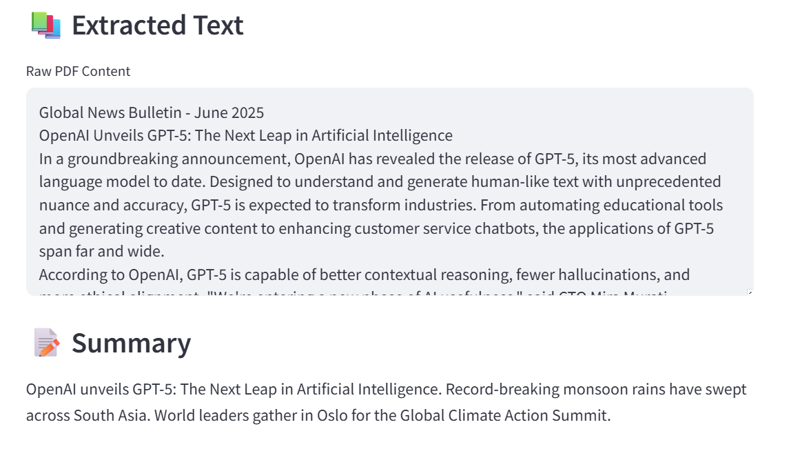
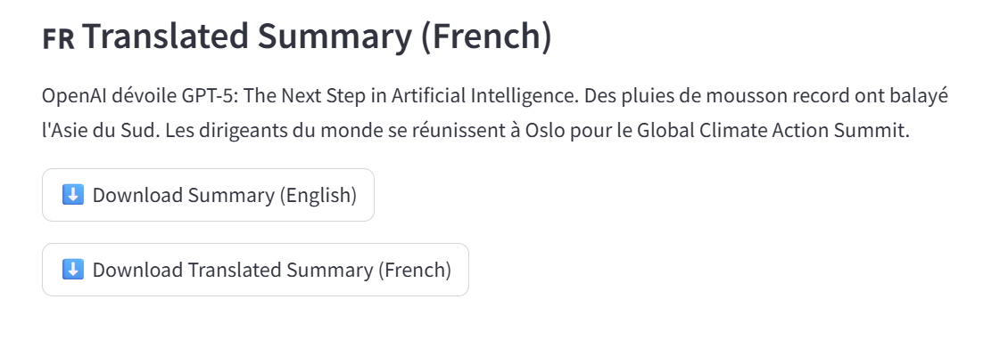

# 📄 PDF Summarizer & Translator

This is a Streamlit app that allows users to **upload a PDF**, extract the text, **summarize it using a transformer-based LLM**, and then **translate the summary into French**. The app uses Hugging Face's `transformers` library and `PyMuPDF` for PDF processing.

---

## 🚀 Features

* 📄 Upload any PDF file
* 🧠 Summarize text using an LLM 
* 🌍 Translate the summary from English to French
* 📅 Download the English and French summaries files
* 🔤 Clean and interactive UI built with Streamlit

---

## 📸 Screenshots

---

## ✨ Future Improvements

* Add support for multilingual PDFs
* Enable summarization in other languages
* Add Q\&A over PDF using LLMs like LLaMA or Mistral

